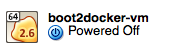

[https://github.com/boot2docker/osx-installer](https://github.com/boot2docker/osx-installer)
___

#### New Boot2Docker VM 
```$ boot2docker init```

#### Start the VM 
```$ boot2docker start```

#### Display env vars
```
$ boot2docker shellinit
```

#### Set env vars

Which..?

```
$ $(boot2docker shellinit)
```

```
$ eval $(boot2docker shellinit)
```


#### Status  
```$ boot2docker status```

#### Version 
```$ docker version```

#### IP of the boot2docker VM
```
$ boot2docker ip
```

#### Stop boot2docker

```
$ boot2docker stop
```



#### Docker run Ubuntu image

[https://docs.docker.com/userguide/dockerizing/](https://docs.docker.com/userguide/dockerizing/)

```
~/site $ docker run ubuntu:14.04 /bin/echo 'Hello world'
Hello world
~/site $ docker run -t -i ubuntu:14.04 /bin/bash
root@47810e939014:/# pwd
/
root@47810e939014:/# whoami
root
```
> As with our previous container, once the Bash shell process has finished, the container is stopped.

More example from same page above (```$ history``` output)

```
574  docker run -d ubuntu:14.04 /bin/sh -c "while true; do echo hello world; sleep 1; done"
575  docker ps
576  docker logs hopeful_turing
577  docker stop hopeful_turing
578  docker ps
```

___

## Troubleshooting

[http://viget.com/extend/how-to-use-docker-on-os-x-the-missing-guide](http://viget.com/extend/how-to-use-docker-on-os-x-the-missing-guide)

___


Was getting unable to start boot2docker

[https://github.com/boot2docker/boot2docker/issues/625](https://github.com/boot2docker/boot2docker/issues/625)

```
$ sudo boot2docker start
Password:
error in run: Failed to get machine "boot2docker-vm": machine not exist
~/site $ boot2docker init
Virtual machine boot2docker-vm already exists
~/site $ boot2docker start
Waiting for VM and Docker daemon to start...
.oooooooooooooooooooooooooooooooooooooooooooooooooooooooooooooooooooooooooo
Started.
  Trying to get Docker socket one more time
Error requesting socket: exit status 2
Writing /Users/ericdorsey/.boot2docker/certs/boot2docker-vm/ca.pem
Writing /Users/ericdorsey/.boot2docker/certs/boot2docker-vm/cert.pem
Writing /Users/ericdorsey/.boot2docker/certs/boot2docker-vm/key.pem
Auto detection of the VM's Docker socket failed.
Please run `boot2docker -v up` to diagnose.
```


```
~/site $ boot2docker stop
```

Deleted boot2docker-vm in VirtualBox GUI

```
foo
```

```
~/site $ boot2docker -v init
```

```
~/site $ boot2docker start
Waiting for VM and Docker daemon to start...
............................ooooooooooooooooooooooo
Started.
Writing /Users/ericdorsey/.boot2docker/certs/boot2docker-vm/ca.pem
Writing /Users/ericdorsey/.boot2docker/certs/boot2docker-vm/cert.pem
Writing /Users/ericdorsey/.boot2docker/certs/boot2docker-vm/key.pem
To connect the Docker client to the Docker daemon, please set:
    export DOCKER_HOST=tcp://192.168.59.104:2376
    export DOCKER_CERT_PATH=/Users/ericdorsey/.boot2docker/certs/boot2docker-vm
    export DOCKER_TLS_VERIFY=1
```

Did this:

```
~/site $ export DOCKER_HOST=tcp://192.168.59.104:2376
~/site $ export DOCKER_CERT_PATH=/Users/ericdorsey/.boot2docker/certs/boot2docker-vm
~/site $ export DOCKER_TLS_VERIFY=1
```

---
Dont use ```sudo``` ?

```
~/site $ $(boot2docker shellinit)
Writing /Users/ericdorsey/.boot2docker/certs/boot2docker-vm/ca.pem
Writing /Users/ericdorsey/.boot2docker/certs/boot2docker-vm/cert.pem
Writing /Users/ericdorsey/.boot2docker/certs/boot2docker-vm/key.pem
~/site $ sudo docker run ubuntu:14.04 /bin/echo 'Hello world'
FATA[0000] Post http:///var/run/docker.sock/v1.17/containers/create: dial unix /var/run/docker.sock: no such file or directory. Are you trying to connect to a TLS-enabled daemon without TLS?
~/site $ docker run ubuntu:14.04 /bin/echo 'Hello world'
Unable to find image 'ubuntu:14.04' locally
511136ea3c5a: Pull complete
```

Added to ```~/.bash_profile```:

```
### For Docker
$(boot2docker shellinit)
```

___

```
FATA[0000] ....
... Are you trying to connect to a TLS-enabled daemon without TLS?
```

[https://github.com/boot2docker/boot2docker/issues/648](https://github.com/boot2docker/boot2docker/issues/648)
