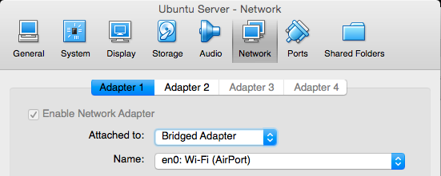
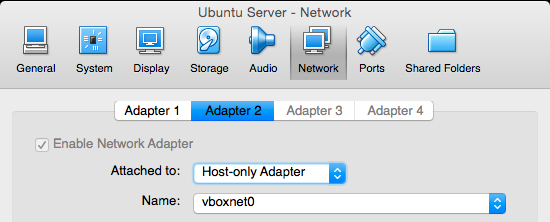

# **Objectives of this How To**:

1. Create an Ubuntu Server VM (headless Linux) guest that we can SSH into from OSX host

*\* This doc assumes you already have Virtualbox installed on your Mac*

___

### Download Ubuntu Server .iso
[http://www.ubuntu.com/download/server](http://www.ubuntu.com/download/server)

### Create new VM from that .iso
[http://docs.oracle.com/cd/E26217_01/E26796/html/qs-create-vm.html](http://docs.oracle.com/cd/E26217_01/E26796/html/qs-create-vm.html)

### Modify Network Adapters in Virtualbox

#### Change Adapter 1 to "Bridged":

There are probably a lot of ways to do this, however, changing ```Adapter 1``` allowed pinging out to ```google.com``` etc from the guest VM. 



#### Add new Adapter2, "Host-only Adapter"

This is a prerquisite for our local vbox subnet stuff below (```192.168.56.x```).



### Configure new adapter to use DHCP

Boot up the VM. From within the VM:

```
$ sudo vi /etc/network/interfaces
```

Add:

```
auto eth1
iface eth1 inet dhcp
netmask 255.255.255.0
```

Reset the adapter:

```
sudo ifdown eth1 && sudo ifup -v eth1
```

View resulting IP of guest VM:


```
$ifconfig eth1
eth1      Link encap:Ethernet  HWaddr 08:00:27:c9:d8:ff
          inet addr:192.168.56.102  Bcast:192.168.56.255  Mask:255.255.255.0
          inet6 addr: fe80::a00:27ff:fec9:d8ff/64 Scope:Link
          UP BROADCAST RUNNING MULTICAST  MTU:1500  Metric:1
          RX packets:3845 errors:0 dropped:0 overruns:0 frame:0
          TX packets:2471 errors:0 dropped:0 overruns:0 carrier:0
          collisions:0 txqueuelen:1000
          RX bytes:323860 (323.8 KB)  TX bytes:366300 (366.3 KB)
```
___
View gateways in the guest VM:

```
$ ip route
default via 192.168.1.1 dev eth0
192.168.1.0/24 dev eth0  proto kernel  scope link  src 192.168.1.11
192.168.56.0/24 dev eth1  proto kernel  scope link  src 192.168.56.102
```


### Use Static IP instead

From within the Ubuntu VM:


```
$ sudo vi /etc/network/interfaces
```

Add:


```
auto eth1
iface eth1 inet static
address 192.168.56.102
netmask 255.255.255.0
```

Reset the adapter:

```
sudo ifdown eth1 && sudo ifup -v eth1
```

View resulting IP of guest VM:

```
$ ifconfig eth1
eth1      Link encap:Ethernet  HWaddr 08:00:27:c9:d8:ff
          inet addr:192.168.56.102  Bcast:192.168.56.255  Mask:255.255.255.0
          inet6 addr: fe80::a00:27ff:fec9:d8ff/64 Scope:Link
          UP BROADCAST RUNNING MULTICAST  MTU:1500  Metric:1
          RX packets:386 errors:0 dropped:0 overruns:0 frame:0
          TX packets:290 errors:0 dropped:0 overruns:0 carrier:0
          collisions:0 txqueuelen:1000
          RX bytes:42325 (42.3 KB)  TX bytes:36009 (36.0 KB)
```
___

If we want to be able to ping, or SSH to, the VM by hostname, we can add an entry to the hosts file on the primary host. From the host:

Optionally make a backup of the ```/etc/hosts``` file first:

```
/etc $ sudo cp hosts 2015-03-14_hosts.bak
Password:
```

```$ sudo gvim hosts```

Add new entry:

```
# Virtualbox headless Ubuntu Server
192.168.56.102 vubuntuserv
```

From the OSX host:

```
$ ping vubuntuserv
PING vubuntuserv (192.168.56.102): 56 data bytes
64 bytes from 192.168.56.102: icmp_seq=0 ttl=64 time=0.388 ms
64 bytes from 192.168.56.102: icmp_seq=1 ttl=64 time=0.423 ms
```

___

### Useful Python stuff

#### Install pip and python dev

Inside the Ubuntu VM:

```$ sudo apt-get install python-pip```

```$ sudo apt-get install python-dev```

```$ sudo pip install netifaces```

#### Get local subnet IP of VM in Python

```
$ ipython
```

From [http://stackoverflow.com/a/8287065](http://stackoverflow.com/a/8287065):


```
In [1]: import netifaces

In [2]: netifaces.interfaces()
Out[2]: ['lo', 'eth0', 'eth1']

In [3]: netifaces.ifaddresses('eth1')[2][0]['addr']
Out[3]: '192.168.56.102'
```