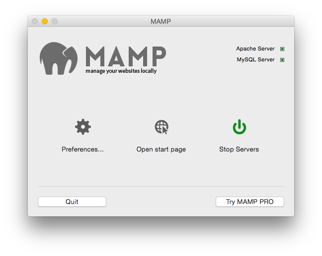

# MAMP add Virtual Hosts
**Objective:**  
Serve more than the /htdocs folder from MAMP's Apache

Instructions for OSX.

### Enable Virtual Hosts
Open ```/Applications/MAMP/conf/apache/httpd.conf```, ensure that the ```Include /Applications/MAMP/conf/apache/extra/httpd-vhosts.conf``` line is uncommented:

```
# Virtual hosts
Include /Applications/MAMP/conf/apache/extra/httpd-vhosts.conf
```
### Add a new Virtual Hosts entry
Open ```/Applications/MAMP/conf/apache/extra/httpd-vhosts.conf```, add a new entry for your site/folder:

```
<VirtualHost *:8888>
    ServerAdmin webmaster@golfcard
    DocumentRoot "/Users/my/local/path"
    ServerName golfcard.local
    ErrorLog Users/my/local/path/logs/apache_error.log
    CustomLog /Users/my/local/path/logs/apache_access.log combined
</VirtualHost>
```
*([configuring MAMP logging](MAMPlogging.md))*

### Add the new entry to hosts file 

Open ```/etc/hosts``` (```/etc $ sudo mvim hosts```), add new entry for your project:

```
# MAMP Virtual Hosts
127.0.0.1 golfcard.local
```

If opening Vim from Finder instead of ```sudo``` from command line, can't save the read only hosts file, so from within Vim we can use:

```
:w !sudo tee % > /dev/null
```

(*[from this SO question](http://stackoverflow.com/questions/8253362/etc-apt-sources-list-e212-cant-open-file-for-writing/8253435#8253435))*

### Restart MAMP Apache:  
```
/Applications/MAMP/bin/apache2/bin/apachectl stop
```

**MAMP Stopped:**


```
/Applications/MAMP/bin/apache2/bin/apachectl start
```

**MAMP Started:**


### Browse to the location
*Note*: MAMP uses port 8888 by default (can be changed in the preferences).

#### Browser on the Mac running MAMP:  
[http://golfcard.local:8888/](http://golfcard.local:8888/)

#### From a different device on same subnet (iPhone, another PC, etc)
First, from the Mac running MAMP, find the Mac's IP:

```
$ ifconfig | grep "inet 192.168"
	inet 192.168.1.3 netmask 0xffffff00 broadcast 192.168.1.255
```
In example above, router is configured to hand out 192.168.x.x adresses, and the Mac currently has 192.168.1.3, so: 

From iPhone or other device browser:  
[http://192.168.1.3:8888](http://192.168.1.3:8888) 

___
#### Other potentially useful reference material
* [http://www.daigo.org/2013/06/setting-up-virtual-host-on-mamp-on-mac-os-x-mountain-lion/](http://www.daigo.org/2013/06/setting-up-virtual-host-on-mamp-on-mac-os-x-mountain-lion/)
* [http://eppz.eu/blog/virtual-host-for-mamp-on-osx/](http://eppz.eu/blog/virtual-host-for-mamp-on-osx/)
* [http://chapterthree.com/blog/quick-command-line-tips-local-drupal-development-mamp](http://chapterthree.com/blog/quick-command-line-tips-local-drupal-development-mamp)
* [http://sawmac.com/mamp/virtual/](http://sawmac.com/mamp/virtual/)

