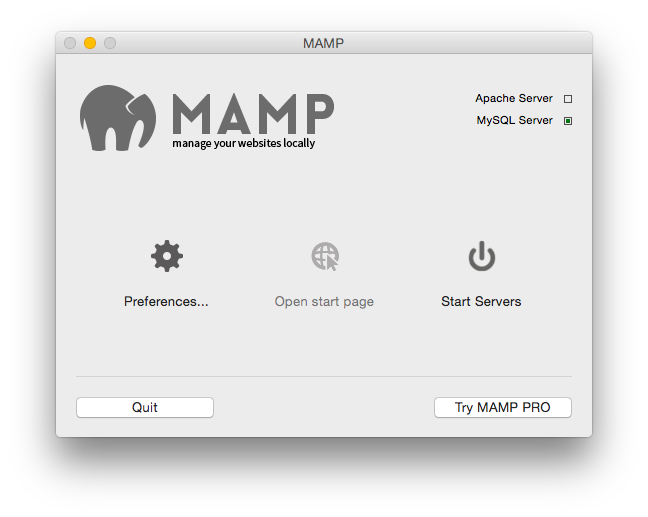
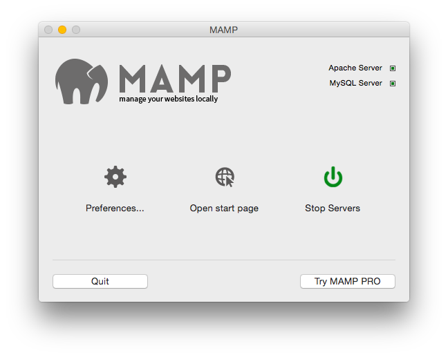

# MAMP add Virtual Hosts
**Objective:** Serve more than the /htdocs folder from MAMP's Apache

Instructions for OSX.

### Enable Virtual Hosts
Open ```/Applications/MAMP/conf/apache/httpd.conf```, ensure that the ```Include /Applications/MAMP/conf/apache/extra/httpd-vhosts.conf``` line is uncommented:

```
# Virtual hosts
Include /Applications/MAMP/conf/apache/extra/httpd-vhosts.conf
```
### Add a new Virtual Hosts entry
Open ```/Applications/MAMP/conf/apache/extra/httpd-vhosts.conf```, add a new entry for your site/folder:

```
<VirtualHost *:8888>
    ServerAdmin webmaster@golfcard
    DocumentRoot "/Users/my/local/path"
    ServerName golfcard.local
    ErrorLog "logs/golfcard.error_log"
    CustomLog "logs/golfcard.access_log" common
</VirtualHost>
```
### Add the new entry to hosts file 

Open ```/etc/hosts``` (```/etc $ sudo mvim hosts```), add new entry for your project:

```
# MAMP Virtual Hosts
127.0.0.1 golfcard.local
```

If opening Vim from Finder instead of ```sudo``` from command line, can't save the read only hosts file, so from within Vim we can use:

```
:w !sudo tee % > /dev/null
```
From:  
[http://stackoverflow.com/questions/8253362/etc-apt-sources-list-e212-cant-open-file-for-writing/8253435#8253435](http://stackoverflow.com/questions/8253362/etc-apt-sources-list-e212-cant-open-file-for-writing/8253435#8253435)

### 

Restart MAMP Apache:  
```
/Applications/MAMP/bin/apache2/bin/apachectl stop
```

**MAMP Stopped:**


```
/Applications/MAMP/bin/apache2/bin/apachectl start
```

**MAMP Started:**


### Browse to the location
MAMP uses port 8888 by default (can be changed in the preferences):

[http://golfcard.local:8888/](http://golfcard.local:8888/)

