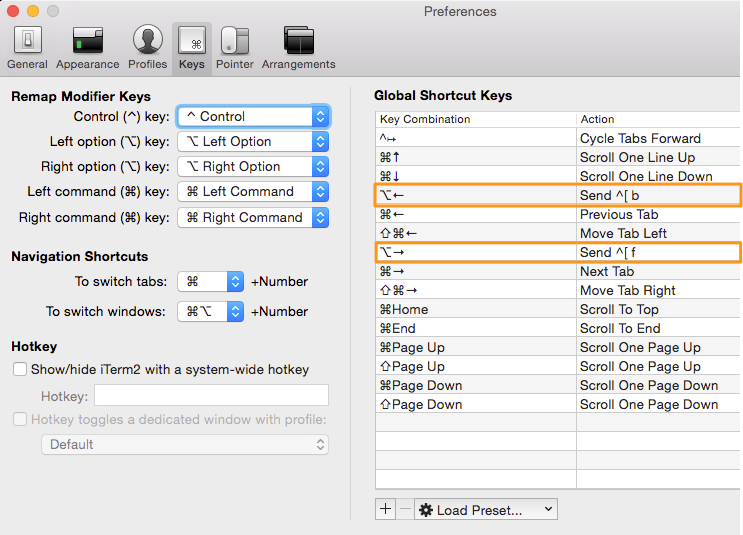

## Links

* [http://stackoverflow.com/questions/81272/is-there-any-way-in-the-os-x-terminal-to-move-the-cursor-word-by-word](http://stackoverflow.com/questions/81272/is-there-any-way-in-the-os-x-terminal-to-move-the-cursor-word-by-word)
  * And especiallyt this part: [http://stackoverflow.com/questions/81272/is-there-any-way-in-the-os-x-terminal-to-move-the-cursor-word-by-word/8250989#8250989](http://stackoverflow.com/questions/81272/is-there-any-way-in-the-os-x-terminal-to-move-the-cursor-word-by-word/8250989#8250989)
* [http://stackoverflow.com/questions/6205157/iterm2-how-to-get-jump-to-beginning-end-of-line-in-bash-shell](http://stackoverflow.com/questions/6205157/iterm2-how-to-get-jump-to-beginning-end-of-line-in-bash-shell)

## OSX Full Word Cursor Movement in iterm2

> Out of the box you can use the quite bizarre `Esc+F` to move to the beginning of the next word and `Esc+B` to move to the beginning of the current word.

**^ But that sucks.**

#### For `option + left arrow` and `option + right arrow` full word navigation on command line:

(`option` being the key on a MacBook that has `alt` and `option` on it)

#### Copy default profile to new (so we can revert if need be)

#### Add new Global Shortcut Keys

